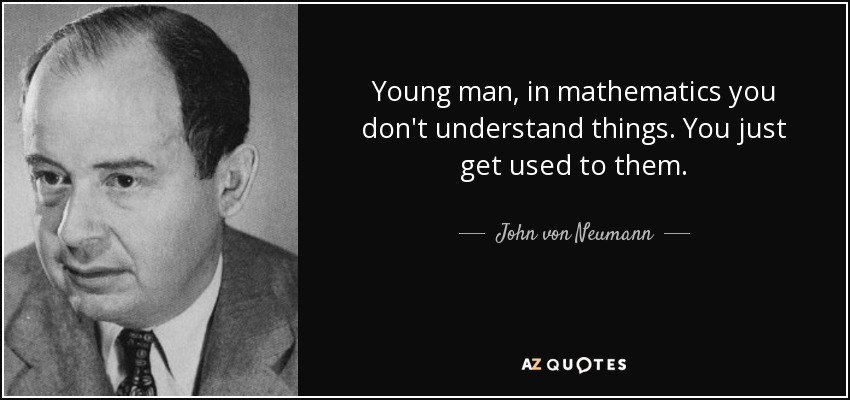

# 记录着，叹息着，期盼着

## 建立缘由

我是个很普通的人，自然也会有偷懒，迷茫，恍惚的时光。写这份日记是为了记录自己，看着自己一天天，一点点向上攀爬的样子。希望多年后自己能成为很厉害的人，回首时一边看着自己的来时路，一边哑然失笑。

## 对看这份日记的人，一些想说的

如果您是个很厉害的，已经在半山腰或是临近山巅的成熟开发者，这只不过是个小萌新步履蹒跚的玩具日记罢了。但如果您也是个对计算机，对前端有些兴趣，但却患得患失，不知从何入手的普通人，或许它给您心中的困惑带来些答案。

老实说我是个很懒的人，也不喜欢写文档，写文章。我一直秉持着“不是同一个世界的人，再怎么接近，也终究无法重合”和观点。因此我其实对docs持悲观态度，这份日记也主要是为了我自己而已。

不过每个人都有自己的局限性，我也不例外。这份日记基本算我的备忘录和流水账日常，因此只是一份参考。同时屏幕对面的您要做好一个准备就是：**<u>您不一定能完全复刻我的道路</u>**。这不是对您的看轻，不屑或是歧视，而是字面意思上的陈述。我是个很平庸但比较幸运的孩子，在我的一路有很多对我影响深刻的人，或是前辈或是朋友也或是陌路，都对我帮助了很多很多。~~某种意义上，我是个百家理念的集成品（？~~ 可以说是拾人牙慧，也可以说是被“托举而上”的。同时我的专业技术虽然不怎么样，但我对软工`SE`的很多现代技术栈/架构/产品都有较明晰的大致认知，且我对计算机软工`SE`有较高的亲和度，从源头追溯可以到小学三四年级乃至幼儿园时期，不过对计算机科学`CS`尤其是理论层，比如DSA那种直指数学的东东就不怎么样也谈不上喜欢了。我喜欢code，喜欢engineering，但不大擅长scientific。

在当今社会环境下，我见过太多太多在大陆国行手机和低俗短视频平台下，失去对计算机基本理解和亲和的孩子了。傻瓜式的手机阻碍了基本的系统操作能力，无用的庞杂信息流妨碍了自主的探究思考，“民用”化的Windows遮掩了计算机的本质。

每个人都有各自的方向，烧菜的厨子不一定需要了解生火需要的热力学理论，也不一定需要学习如何生出更好用的火，但不能太离谱，至少TA得知道火是什么。**您可以在 计算机科学/软件工程 基础上薄弱，但不能完全被蒙蔽双眼。**



btw，我如今几乎所有工作环境都在`mac`和`gnu/linux`下完成，后者选个您顺眼的，(k)ubunttu就不错。我不喜欢Windows，原因有点罄竹难书，不过如果一路走下去的话，未来您自然会知道的。

:::warning
However，**DONT USE Arch IF U ARE A COMPLETE NEWCOMER**
:::

## 环境介绍

我主要使用`MacOS`作为主要开发设备。使用`iTerm2`作为terminal，使用`zsh`和`oh-my-zsh`三件套插件为shell，我现在主要方向在web上，所以我使用`vsc`，同时样式环境是`Vitesse Theme`+`Material Icon Theme`, linter上我使用`SonarQuobe`。agent上我使用`copilot(vsc)`并多数情况下用Claude4sonnet, **但是我不喜欢vibe coding和大陆市场部推出的agent产品，在面对配置和样式设计时它是💩，您可以拿它来问，但我始终不建议您用它写完整的东西**。

在Kubuntu上我比较懒，用的是kubuntu lts24，但这是有原因的，和我笔记本的联发科偏门网卡以及nvidia有关，这部分未来会在另一篇文章中详谈。`WM`上我使用`x11`，`DE`上我用`kde plasma5`，使用`fish`为shell，因为我懒。当然您大可用`Debian 13`什么的，喜欢啥distro都可以。我们是engineer，不是scientist或社区宗教信徒。

:::important
我始终建议您使用Google，reddit，overflow，gpt/gemini model等，我个人拒绝使用且不建议您使用baidu,csdn,douyin,deepseek,doubao等玩意。我不喜欢大陆的软件生态。
:::

:::warning
不要在学习和练手时用vibe coding，那对教育意义是灾难性的。
:::

------

## 预期roadmap

:::tips
我个人建议您使用`OSX(MacOS)`或任意发行版的`gnu/linux`去尝试参照我的路线，因为这可以帮助您触及很多本质上的东西。正如我上文所述，windows会遮掩本质，以及windows其实在很多地方很麻烦。
:::

大致预期路线：

### 语言/框架

前端部分：

`HTML` -> `CSS` -> `Tailwind css` 写静态web -> `JS` -> 写手搓web -> `npm`(大致了解包管理即可) -> `Vue` -> `TS` -> 写现代webapp -> `Nuxt` -> `React` -> `Next`

```
Branch: Vue   -> scss
        React -> css-in-js, css modules
```

后端部分：

`Nodejs` -> 写CLI app -> `PostgreSQL` -> 写简单的CRUD app -> `RESTful API` -> `JWT Auth` -> `Redis` -> 写一个完整的app

DevOps部分；

未完待续......

### 工具链

Build tool: `Vite` `Webpack`, serving to bundle and optimize web applications.

Bundler: `ESBuild`

Deploy: `Vercel`, `Netlify`

Linter: `ESlint`, `SonarQuote`

------

## ~~流水账~~

### 2025-10-9  00:20

W3S tutorial, `HTML`

Now, Chapter : `Forms` Section : `HTML Input Attributes`

### 2025-10-9  09:00

W3S tutorial, `HTML`

Finish `Forms` chapter learning

Now, Chapter : `Media` 

### 2025-10-10  02:18

W3S tutorial, `CSS`

Finish `HTML` part learning

预期学习概况：

必学：

- 选择器：基础（`#id`, `.class`, `tag`），组合选择器，伪类（`:hover`, `:focus`），伪元素（`::before`, `::after`）
- 盒模型：`margin`, `padding`, `border`, `width/height`, `box-sizing`
- 布局：`display`（block, inline, inline-block, flex, grid），`position`（static, relative, absolute, fixed, sticky）
- 字体与文本：`font-size`, `line-height`, `font-family`, `text-align`
- 背景与颜色：`background`, `color`, `opacity`
- 响应式：媒体查询（`@media`）
- 动画/过渡：`transition`, `transform`, `animation`（了解即可，常用在按钮 hover 等场景）

初学阶段可以不学：

- CSS 自定义属性（`--var`）→ 初学不常用
- CSS 函数（`calc()`, `clamp()` 等）→ 可后面补
- CSS 高级选择器（`nth-child`, `nth-of-type`）→ 先不碰复杂情况
- CSS Grid 高级特性（自动布局区域命名）→ 学基础网格即可
- CSS 高级动画（关键帧复杂动画）→ React/Tailwind 常用库替代

### 2025-10-10 23:30

- [x] 字体与文本：`font-size`, `line-height`, `font-family`, `text-align`
- [x] 盒模型：`margin`, `padding`, `border`, `width/height`, `box-sizing`

### 2025-10-11 8:30
看文档/视频是在获取知识，亲手写code是在训练技能。

:::important
切记，减少陷入"知识幻觉"的情况！
Coding是一种技能，而不是纯粹的知识。如果您采取了先看完很长篇部分的文档(期间不动手)，然后再尝试写example，这时您的脑子往往会一片空白，反应不过来该怎么做。We are engineers , not scientists.
您应该在学到每个(几个)可以独立起效的概念时，尝试动手去进行 复现->改造->观察 这样的重复过程。这就是我的best practice。
:::

这也是我一次次强调，避免在newcomer时用agent写东西的缘故之一，vibe写出的不是您自己的。

### 2025-10-12  23:45

今日休战，写了篇关于`Linux`安装历程和不喜欢windows原因的[post](https://www.mias.moe/posts/install-linux-in-laptop/)

同时在纠结要不要写个用于页内bookmark跳转后暂时高亮:target的css/js，llm不好用，问厉害的前辈不太搭理我，难过

可能是我的问题太低端了吧，可是我也问不出什么更厉害的问题了呀，唉。。。

给校内的教授写了邮件，不知道我一个做软工`SE`的能不能被转专业，我不想干两三年的牛马活和写生化论文毕设。

今天是不太开心的一天。

### 2025-10-13 3:20

理解概念，梳理构造，分剥问题，书写实现，整合连结

工程的本质是一次又一次类似操作流程的完成，互相契合的齿轮互相带动，形成了完整的大厦。

这也是`SE`每天都在做的事情。我喜欢这样的重复，虽然它一眼望得到头hhh

### 2025-10-13 13:00

第一次给大大的repo [Dify](https://github.com/langgenius/dify/pull/26745)提 PR，被merged了，虽然没什么难度，但很开心。很感谢湊老师ww

### 2025-10-15 21:30

因为一些事，想起来之前被一位很厉害的朋友带去和一群很厉害的CS方向的人吃饭，被其他人问自己的学校和专业是什么时的情景了hhh

感觉自己所在的 “位置” 说出口都是一种，莫大的自卑和丢人。他们那才配称之为真正的“大学”，至于我嘛... ww，多说无益。

### 2025-10-16 01:36

看一篇某校的面向新人wiki有感，发觉自己犯了个很大的错误

我太多的用被一些厉害的人，潜移默化/耳濡目染下的，学`CS`的态度去学`SE`。 纠结没什么鸟用的`css property` rendering顺序等等类似的事情，每小时十几次问llm旁枝末节，这些都太冗余和拖慢进度了，应该是一切以“写”和“做”为导向才对。

我纠结太多没用的细节了，那种“先做了再说，细节回头补”的做法才是更合适的（ 这才是Software Engineer该有的、更合适的做法。

被湊老师喂饭+1 ：面对 [gemini2.5p](ai,dev) 需要调整temperature为 0 ，会得到更好用和专业的结果。湊老师说我需要看 [这个](https://github.com/karpathy/llm.c/blob/f1e2ace651495b74ae22d45d1723443fd00ecd3a/train_gpt2.py#L273 ) ，唉他昨天就发我了，结果昨天一整天都在不知道做什么，拖拖拉拉的没看。

我有好多好多要做的事情，永远也做不完、堆积如山的需要 看/学 的docs内容，却总是想着偷闲。真的好羡慕那些可以无虑过完“青春年华”的人生啊。。。或许我该进一步的减少和 室友/本校同学 以及这个无用学校的交互了，对正事毫无帮助。
