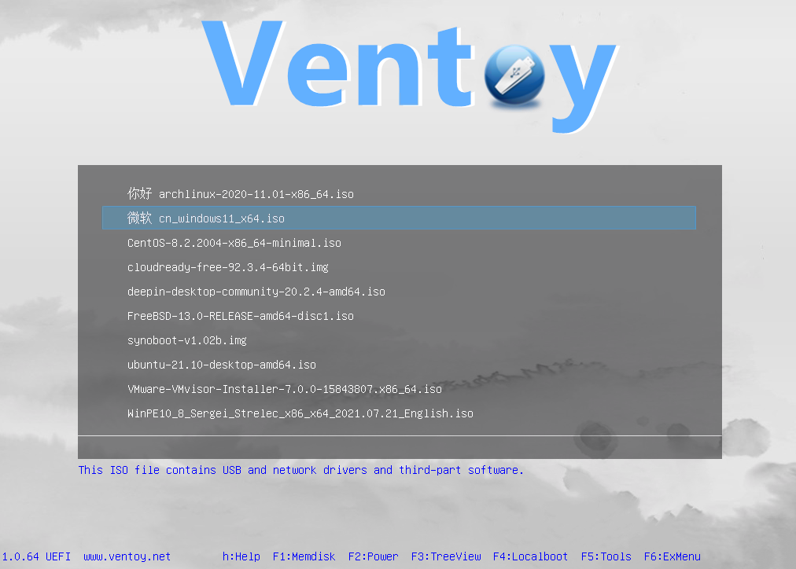

# 前言

这是篇关于我为什么选择使用kubuntu，以及期间一些经历和解决方案的文章

我不喜欢windows，当然我也不是那种在desktop上堆一堆folder，连brew包管理和shell都不会用的果粉。

Windows遮掩了很多东西，过度的gui，冗余的组件，难堪其用的权限分配和目录树，见鬼一样的sh `env`等等都是我不用它干活的理由。一言以蔽之：**Windows很适合日常民用，但不适合多数触及本质的开发**。您会不得不需要大量的`虚拟化环境`，啥都整合的`IDE`，以及大量的兼容性，版本管理问题。同时：

1. wsl2有着众所周知的跨文件系统极其拉垮的读写性能
2. vmware有着神秘非常的网络配置问题
3. hyper-v的网桥数次让我Windows主体的`DE`崩溃。

我是个高度的实用主义者，我不在乎是`MacOS`还是`Linux`的哪个distro，方便好用就行。当然，如果您是做基架/计算机科学向的，那需要额外的考量。

------

## 安装 - 1. Arch Linux

### 背景

我想您曾在数次在各个社区/info上看到这句 "~~btw, i use arch~~"

Hey,bro,我想其中还有不少使用来自东方的二次元纸片小人，其中又有不少背景是彩虹或🍥（）

但就我个人平心而论，我真不觉得complete newcomer用arch是啥好主意，您会以至少6t/h的速率去高频骚扰agnet/llm，然后又使用更多的时间去问询关于linux基础架构和底层实现的知识。不是每个人都做计算机科学方向，也不是所有人都会在乎哪个犄角旮旯的包是崩溃的罪魁祸首。您修/问等折腾的时间将会远远超过您在特定环境下完成期望的工作/学习的时间，请牢记：**You are just a newcomer,not long-term open-source contributor or scientist.** 很多知识/技能不是您当下该学的，您也学不会，学会也要花费很多不值得的时间精力。</spam>

时间到了，您自然会需要，会根据自己的需求接触到。

### 过程

我使用`Ventory`来创建`bootable USB drive`，u盘是三星64g的闪存，我喜欢稳定和适量的冗余余地，我对镜像损坏有阴影。同样，因为我实用主义~~懒~~。这个工具创建`USB driver`可以同时放入多个镜像文件，而且只需要把iso拖入进存储分区就行，不需要反复formant，而且除了`UEFI`外的存文件的分区可以当作正常u盘来放文件，我可不想买个u盘只能当安装介质。

我使用`archinstall`来安装，这是一个helper library，很多人抱怨它不能手动分区（这一点其实新版的镜像附带的`archinstall`已经解决了）以及失去了手动学习arch的机会。但我不在乎这个，我只想有个合适的工作环境。~~**工具做出来就是给人用的嘛。**~~ 不过当然了，以后有机会/空闲时我会"朝圣"一番拜读纯手工安装的arch wiki的，但现在不是时候。然后就是非常固定的：

1. 进入`bios`，关闭`Secure Boot`(安全启动)，调整efi顺序为ventory优先

2. 联网和配置临时代理:

   `export http_proxy="http://proxy-host-address:proxy-lan-port"`

   `export https_proxy="$http_proxy"`
   

:::tips
1.这里有个小坑，一些游戏本会在新live环境自动启动飞行模式以禁用网卡，造成您在iwconfig时看不到网卡存在，您只需要用键盘的Fn key关闭飞行模式即可
2.强烈建议您用rj45网线链接路由器lan口，然后用手机clash系代理app进行LAN Proxy，以最大化减少不必要的麻烦
:::

3. 进入`archlive`， `pacman -Sy archinstall`更新
4. `archinstall`，然后把它要求您必填的字段全处理好，包括分区，时区，镜像下载来源，nvidia driver，root/user账密等等

:::warning
请务必选择nvidia的闭源专有驱动，以及在这之后禁用自带的nouveau开源驱动（让你看个亮的）
:::

5. 进入kde后，再次配置临时代理，安装字体，fx5输入法，`fish shell`，您喜欢的代理cli/gui

至此主体安装以及结束了，但剩下的细枝末节实在是难以数尽，包括但不限于: 

- 部分app window在`Wayland`下字体渲染模糊
- 内置网卡上下行速率奇慢无比(树外驱动)，~~这里特指联发科某些偏门/邪门玩意~~
- nvidia睡死，桌面环境渲染输出崩溃
- 明明支持`Wayland`但默认不启用，查arch wiki：u need add the flag `--ozone-platform-hint=auto --enable-wayland-ime `to the launch file for Chrome (often located in `/usr/share/applications/google-chrome.desktop` ) [**Native Wayland support**](https://wiki.archlinux.org/title/Chromium#2.9:~:text=Xwayland%2Drelated%20crashes.-,Native%20Wayland%20support,-Chromium%20140%20supports)

于是乎，我放弃arch了。因为 <a href="#self-awareness">上文所提</a>。
