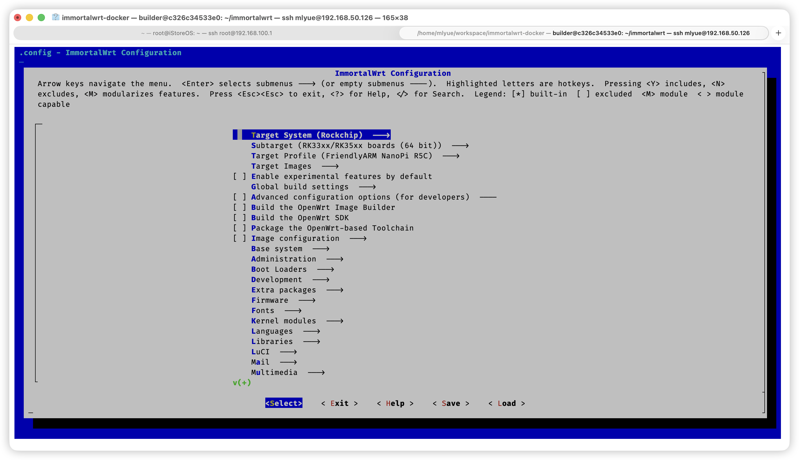
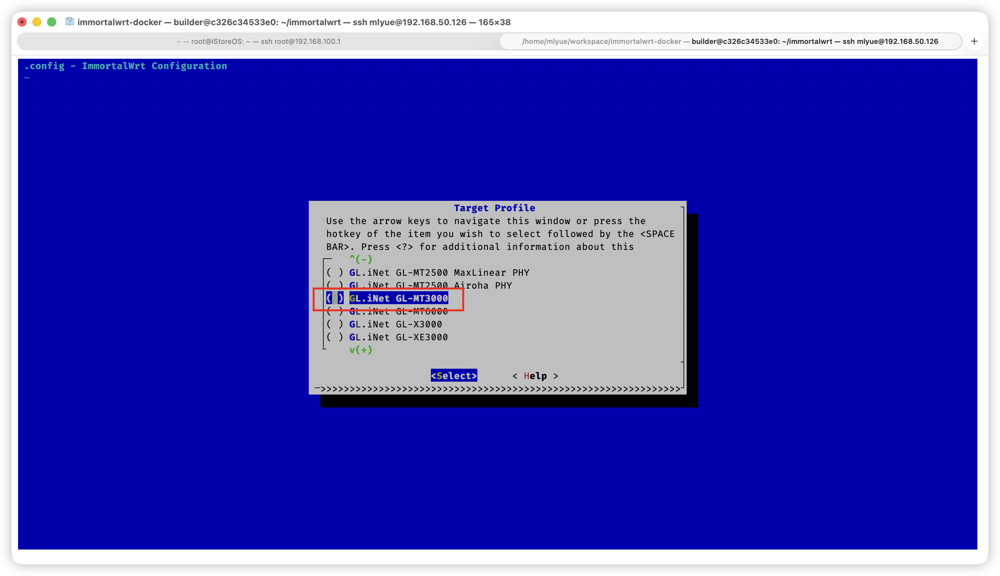

## 背景

- 学校校园网网关限制了每个带宽账号2个`mac`——这对我的超过7个设备是极大的阻碍。
- AP隔离使得内网设备间不可通信。**AP/Client Isolation 在 L2 层面拦截站对站流量**，这意味着它阻止了无线客户端之间直接交换以太网帧（ARP、IPv4/IPv6 unicast）。因为没有 L2 通道，基于直接 IP 的会话（比如 SSH/TCP 连接、UDP 单播、广播）通常无法建立，这是帧 Frame 级别的阻拦，不可绕过——这对我多设备通信极不友好。
- 我有些设备不便于在本地代理，或者其l3/4无法被捕获/转发。
- 我没玩过软路由，~~给自己找点罪受，~~，体验实践一遍软路由整套部署的大致工作流。

普及下 router-based proxy 和 device-based proxy 的区别

router-based：

| 类型                           | 例子                                   | OSI 层  | 原理                                                         |
| ------------------------------ | -------------------------------------- | ------- | ------------------------------------------------------------ |
| **NAT（网络地址转换）**        | OpenWrt、iptables MASQUERADE           | L3 / L4 | 直接改写 IP 头和 TCP/UDP 端口，不看应用层内容。纯粹的数据包转发。 |
| **TProxy / REDIRECT 透明代理** | Clash、Surge、OpenClash、Xray 透明代理 | L3 / L4 | 捕获所有目的端口流量，把 TCP/UDP 流导入本地监听的代理进程（例如 HTTP/SOCKS）。代理进程再在 L7 层解析。 |
| **防火墙规则/路由策略**        | iptables、nftables、ip rule、ip route  | L3 / L4 | 依据 IP 和端口做流量重定向或丢弃，不理解 L7 内容。           |
| **软路由中的代理核心**         | Clash、Xray、V2Ray、Sing-box           | L7      | 在路由器中运行的代理引擎本身理解 HTTP、TLS、QUIC、SOCKS 协议。属于应用层代理，但它接收的流量是从内核 L4 转发来的。 |

device-based：

| 类型                   | 示例                                       | OSI 层                            | 原理                                                         |
| ---------------------- | ------------------------------------------ | --------------------------------- | ------------------------------------------------------------ |
| **HTTP 代理**          | 系统设置中的 HTTP Proxy、Surge、Quantumult | L7                                | 应用发送 HTTP 请求给代理，代理解析并转发。处理的是应用层 HTTP 协议。 |
| **SOCKS5 代理**        | Shadowsocks、Clash 本地模式                | L7                                | 代理客户端封装 TCP/UDP 连接请求，通过 SOCKS 协议转交代理服务器。 |
| **VPN App / Tun 驱动** | Clash Tun、WireGuard、Outline、OpenVPN     | L3~L4（虚拟网卡）+ L7（代理引擎） | 虚拟网卡捕获 IP 包（L3），然后交给 L7 的代理协议（如 Shadowsocks、Vmess、Trojan）处理。 |

然后这个 [gl-mt3000](https://openwrt.org/toh/gl.inet/gl-mt3000) 在硬路由上性价比和社区名声不错，但单纯就软路由来说，并不算是性价比很好的选择，而是个妥协。既要天线2.4g+5g高频宽、usb-device + 2.5g wan口 接入等硬路由需求，又要openwrt supporting list "榜上有名"，还要有轻便小巧+售后兜底，那肯定是有代价的（

友善系列可玩度高，但价格太抽象了，且仅能做软路由用途，不考虑（）而且我很 ~~实用主义~~ 懒，着实不想在工作流外的事情上花太多时间，我没那么多闲空。

`MediaTek MT7981BA` 这个CPU作为arm平台，那转发处理肯定是性能远不如E5等便宜好用x86平台的，但没办法，我总不能为了个软路由在宿舍单独放个itx+ups堆箱 or 裸露开发板+线缆放在宿舍小的可怜的桌面上，那也太抽象了。

这里鸣谢下 [molinyue](https://moliyue.xyz/) 。没有这位在网工上很厉害的朋友，面对软路由这个完全陌生的领域，我可能要自己摸索个少说三天往上（）时间高低得翻个四五倍不止（

## 过程

### 前置部分

首先，我们需要明白的是，openwrt的本质就是linux，是个特化适配了路由器相关软硬件包的轻量`distro`，因此您可以用您对macos（cli）和对linux常规distro共通的常识去对待它。把它当成一个比较好伺候的linux server即可。

它的pack manager是`opkg`，~~听说不太好用~~

```sh
ssh gl-mt3000.local || ssh 192.168.8.1 #出厂默认ipv4是这个  
cat /etc/openwrt_release
cd /etc/opkg
ls -la
cat distfeeds.conf
```

------

如果您发现ssh出现问题，那大概率是"host indentification has changed"，清理下残留host记录就好

```sh
rm -f "$HOME/.ssh/known_hosts"
```

如果您配置过`.ssh/config`，看到诸如"permission error"，那大概率是ssh配置文件的权限设置问题，openssh对此有着严格的安全要求，如果您是 macOS/linux 用户，那非常简单，只需如下，但如果是windows，umm请自行llm/Google

```sh
chmod 600 ~/.ssh/config
```

给不太清楚这个config是做什么的萌新普及下，你可以理解成这是个openssh的配置文件，它是描述性的，而且日常用的话其实配起来很简单，可以省去每次输入完整ipv4以及ssh protocol断链的烦恼，以下为示例：

```
Host *
    AddKeysToAgent yes       # 自动将密钥添加到 ssh-agent
    UseKeychain yes          # macOS 使用 Keychain 管理密码,其他os用户可忽略
    IdentityFile ~/.ssh/id_rsa  # 默认私钥存储文件
    ServerAliveInterval 60   # 每60s尝试一次相应，避免断链
    ServerAliveCountMax 5    # 服务器无响应时，5*60=300s后断链

Host gl-mt3000
    HostName 192.168.8.1     # ipv4
    User root								 # login user
    Port 22                  # ssh开放端口
```

------

`cat`查看信息后，可以清楚的看到这个路由器出厂内置的就是openwrt的一个snapshot, 这点毫无疑问，其区别只是引入了厂商特调的ui和 opkg 源等部分。既然内核完善，具备openwrt luci，是linux且可被ssh，那事情将会变得非常简单

首先摆在您面前的有三个选项 ：

1. 直接前往 [openwrt supported device](https://openwrt.org/toh/gl.inet/gl-mt3000) 下载**Firmware OpenWrt Upgrade URL**(直接进openwrt的 luci ui-web 安装新固件)或者下载**Firmware OpenWrt Install URL**(通过Uboot刷入安装固件)，两者没区别，前者方便的多
2. 前往 [iStore](https://site.istoreos.com/firmware/download?devicename=mt3000) 搜索您的设备型号 gl-mt3000 然后下载tar打包固件，然后同上的第一种安装新固件方式。关于iStore和openwrt的关系/区别请自行llm/Google。不过要说明的是iStoreOS的openwrt内核往往落后官方一些，比如这里是24
3. 自行下载openwrt提供的，包含编译源码ci流程的container，并使用docker或其他容器工具启动/部署，自行选择自己的平台/设备进行编译（）不过放心，gl-mt3000是“榜上有名”的受支持设备，一般不会碰上离谱问题





我是实用主义者~~懒狗~~，于是在经过多方征询实践经验~~摇人~~后我选择2（

然后就等待固件刷入就行，**记得期间不要断路由器电，不碰它最好）**

### 完善部分

好，那么现在您已经得到了纯的不能再纯的软路由了，您可为自己达成了世上99.99%的普通人都没做到的事感到由衷的自豪（？

接下来就不算什么特别重要的事情了，只是一些诸如`openclash`，镜像源配置，一些小坑的注意点等细枝末节，根据个人需求完善即可，本文只介绍我的 personal practice，不然一篇post写着实在太费力了（

题外话：在 2025-10-18 更新本文上传图片时碰上了怪事，vercel部署的webapp url正常，被cf dns解析至vercel部署所在的域名则第一张图片加载失败。怪。

`openclash`的配置其实很简单，只是有几个可能需要留意的小坑。

1. 在github下载ipk，并通过`scp`上传至openwrt/iStore中的`/tmp`缓存区（把它当linux server轻量服务器就好
2. ssh，补齐作者readme中所写的依赖项，`opkg`直装
3. 补齐openclash所需要的内核部分，clash、meta、verge，自选。这里有个要注意的地方就是关于内核安装，项目本身提供了三个镜像源和github url，但这四个有时都会因为网络问题要么不行要么curl下一半断掉。这时您可以多试几次~~大力出奇迹~~，或者干脆去github源址下完内核，然后同理scp上传，并安装至openclash内
4. 余下就是subscribe file，自动生成代理组/策略组config，然后享受您的软路由了

btw，arm平台的软路由确实存在转发能力瓶颈的问题。能用，但有时反应有点慢（tcp握手过程

### 2025-10-25 17:15

补充碰上的小问题：

> [/tmp/clash_latest_version] Download failed: [curl xxxxx]

具体表现为日志里不断滚出此报错，且无法正常测速代理文件内的各个节点

判断为疑似dns问题

解决方法：

```sh
ssh
vim /etc/resolv.conf
```

然后发现其中包含字段如下

```
search lan
namerserver 127.0.0.1
nameserver ::1
```

这玩意一看就不太对劲。。。尝试改为阿里的dns

```
search lan
nameserver 223.5.5.5
```

问题解决。

### 2025-12-9 16:30

首先arm平台存在同价格同功率下低人一等的劣势，软路由用户层转发上先天不足

其次当用它做wifi中继时，我感觉在无线扫描和接口转发配置上经受了莫大的折磨。这似乎和iStoreOS对MT3000的无线固件适配存在一些问题，在更替接口配置时，会出现无法激活/关联无线的窘境（（（

不得不承认，特供有特供的道理（（（

赤了半下午史，发现纯硬路由还是原厂特供的openwrt固件好用（  istore对天线的激活本来就有毛病，死磕不明智

引用某前辈的话：

> （不用管，这些就是能 work 就行

